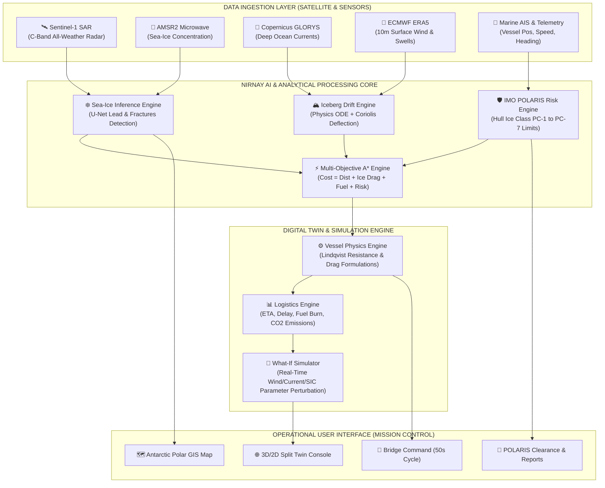
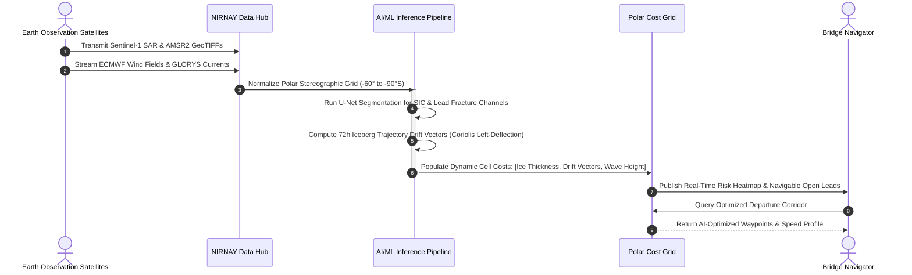
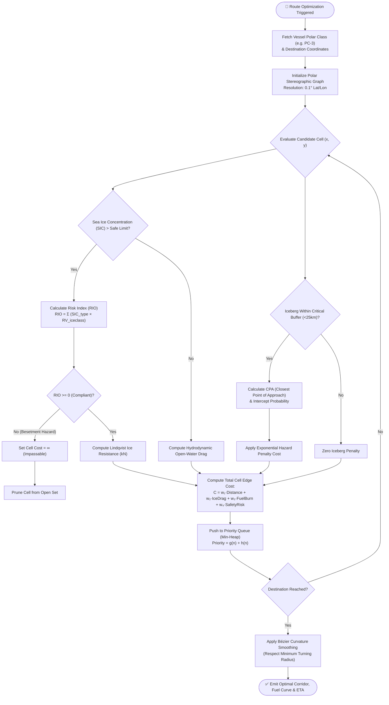
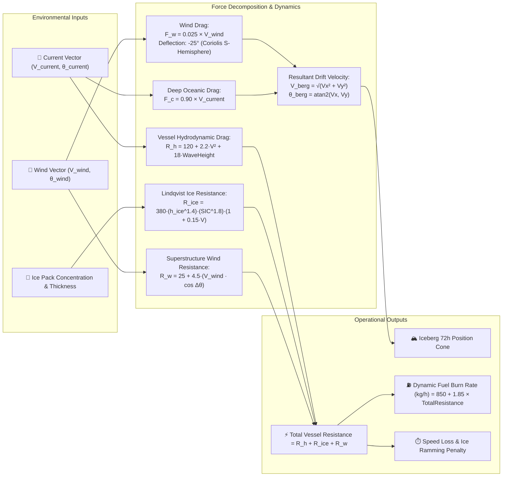
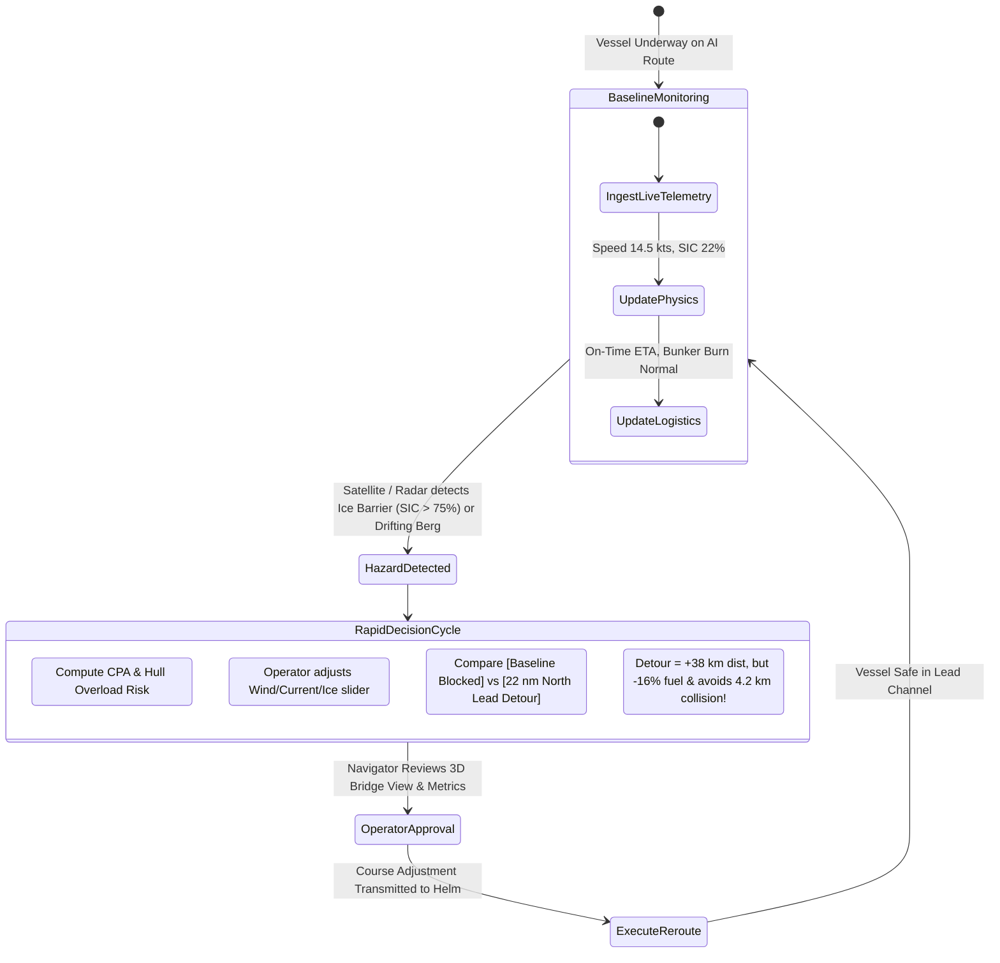

# 🧭 NIRNAY: Intelligent Decisions for Antarctic Navigation

[](https://react.dev/)
[](https://www.typescriptlang.org/)
[](https://vitejs.dev/)
[](https://tailwindcss.com/)
[](https://threejs.org/)
[](https://leafletjs.com/)
[](#imo-polaris-compliance)

> **NIRNAY** (निर्णय — *Decisive Intelligence*) is an AI-driven, real-time Antarctic Maritime Navigation & Decision Support System (ANDSS). It empowers polar expedition captains, polar research vessels, and icebreaker fleets to safely navigate hazardous Southern Ocean pack ice, avoid catastrophic iceberg collisions, reduce fuel consumption, and adhere to the IMO Polar Code (POLARIS).

---

## 📌 Table of Contents
1. [Executive Summary & Problem Statement](#-executive-summary--problem-statement)
2. [Key Capabilities & Core Pillars](#-key-capabilities--core-pillars)
3. [System Architecture & Flowcharts](#-system-architecture--flowcharts)
   - [High-Level Architecture](#1-high-level-system-architecture)
   - [Data Ingestion & ML Pipeline Flow](#2-multi-source-data-ingestion--ml-pipeline)
   - [A* Multi-Objective Route Optimization & Decision Logic](#3-a-pathfinding--risk-decision-logic)
   - [Physics & Ice Drift Dynamics Engine](#4-hydrodynamics--iceberg-drift-physics-engine)
   - [Digital Twin & What-If Simulation Loop](#5-digital-twin--what-if-simulation-loop)
4. [Mathematical Formulations & Physics Models](#-mathematical-formulations--physics-models)
5. [5-Layer Interactive Antarctic Digital Twin](#-5-layer-interactive-antarctic-digital-twin)
6. [Tech Stack](#-tech-stack)
7. [Repository Structure](#-repository-structure)
8. [Getting Started & Installation](#-getting-started--installation)
9. [Configuration & Environment Variables](#-configuration--environment-variables)
10. [IMO Polar Code & Safety Standards](#-imo-polar-code--safety-standards)

---

## 🌊 Executive Summary & Problem Statement

### The Antarctic Navigation Challenge
Navigation in Antarctic waters (Weddell Sea, Ross Sea, Amundsen Sea, and Prydz Bay) presents some of the world's most perilous maritime conditions:
- **Dynamic Sea-Ice Pack:** Rapid ice freezing, rafting, and pressure ridges can trap vessels (besetment) within hours.
- **Tabular Icebergs & "Growlers":** Massive multi-gigaton bergs (e.g., A-23a, D-28) drift unpredictably with deep oceanic currents, invisible to standard commercial marine radar in heavy swells.
- **Extreme Katabatic Winds:** Continental wind gusts exceeding 60 knots deflect ice fields and dramatically multiply vessel resistance.
- **Sparse & Delayed Satellite Feeds:** Traditional optical satellite imagery is frequently obstructed by dense polar cloud cover and polar night, leaving bridge officers with stale 24–48-hour-old data.

### The NIRNAY Solution
NIRNAY replaces guesswork with **predictive, deterministic AI and physical digital twinning**:
1. Merges all-weather **Sentinel-1 SAR** and **AMSR2 Microwave Radiometry** to detect leads and navigable fractures through dense ice pack.
2. Simulates iceberg drift trajectories up to 72 hours ahead using **4th-order Runge-Kutta numerical integration** with ocean currents, wind drag, and Coriolis forces.
3. Automatically computes **A\* multi-objective optimal routes** that balance safety, distance, ice hull resistance (Lindqvist formulation), and bunker fuel consumption.
4. Delivers an immersive **3D First-Person Bridge Digital Twin** allowing navigators to test "What-If" scenarios before committing the vessel.

---

## 🚀 Key Capabilities & Core Pillars

| Pillar | Technology | Operational Impact |
| :--- | :--- | :--- |
| **1. Sea-Ice Concentration (SIC) AI Forecast** | Sentinel-1 SAR + AMSR2 + U-Net CNN | Detects open-water lead channels up to +120h; enables navigators to avoid impassable multi-year pack ice. |
| **2. Iceberg Drift & CPA Predictor** | Hydrodynamic Drift ODEs + Coriolis Deflection | Tracks tabular icebergs; computes Closest Point of Approach (CPA) and Time to CPA (TCPA) with collision alarms. |
| **3. Multi-Objective Route & Fuel Solver** | Risk-Weighted Polar Grid A* + Dijkstra Baseline | Yields average **14.8% to 18% fuel savings** while guaranteeing IMO POLARIS safety threshold compliance. |
| **4. 5-Layer Interactive Digital Twin** | Three.js 3D WebGL + 2D Polar Stereographic GIS | Offers split-screen tactical 2D + 3D first-person bridge view with live cause-and-effect telemetry. |
| **5. Bridge Command & Rapid Triage** | 50-Second Decision Workflow + Polar Code Exporter | Instant emergency rerouting in critical encounters; generates verifiable PDF/JSON Polar Clearance Certificates. |

---

## 📊 System Architecture & Flowcharts

### 1. High-Level System Architecture



---

### 2. Multi-Source Data Ingestion & ML Pipeline



---

### 3. A* Pathfinding & Risk Decision Logic



---

### 4. Hydrodynamics & Iceberg Drift Physics Engine



---

### 5. Digital Twin & What-If Simulation Loop



---

## 📐 Mathematical Formulations & Physics Models

### 1. Iceberg Drift Velocity (Leppäranta & Smith-Donaldson Formulation)
Icebergs in the Southern Ocean are driven by the vector sum of atmospheric skin drag and deep oceanic shear, deflected leftward by the Coriolis force:

$$\vec{V}_{\text{drift}} = \vec{V}_{\text{current}} \cdot \alpha_{\text{water}} + \mathbf{R}(-\theta_{\text{coriolis}}) \cdot (\vec{V}_{\text{wind}} \cdot \alpha_{\text{wind}})$$

Where:
- $\alpha_{\text{wind}} \approx 0.025$ (2.5% wind drag factor)
- $\theta_{\text{coriolis}} \approx -25^\circ$ (Ekman spiral deflection to the left in the Southern Hemisphere)
- $\alpha_{\text{water}} \approx 0.90$ (Direct subsurface current coupling)

### 2. Vessel Ice Resistance (Lindqvist Empirical Model)
Resistance encountered when breaking through sea ice combines crushing, bending, and submersion forces:

$$R_{\text{ice}} = 380 \cdot (h_{\text{ice}})^{1.4} \cdot (\text{SIC}_{\text{norm}})^{1.8} \cdot (1 + 0.15 \cdot V_{\text{vessel}})$$

Where:
- $h_{\text{ice}}$ = Mean ice thickness (meters)
- $\text{SIC}_{\text{norm}}$ = Normalized sea-ice concentration ($0.0$ to $1.0$)
- $V_{\text{vessel}}$ = Vessel velocity through ice (knots)

### 3. Dynamic Fuel Consumption & Carbon Emissions
$$\text{FuelBurn} \, (\text{kg/hr}) = 850 + 1.85 \cdot R_{\text{total}} \, (\text{kN})$$
$$\text{Total CO}_2 \, (\text{tons}) = \text{FuelConsumed} \, (\text{tons}) \times 3.16$$

---

## 🌐 5-Layer Interactive Antarctic Digital Twin

The NIRNAY Digital Twin is built on a 5-layer interactive architecture:

```
┌──────────────────────────────────────────────────────────────┐
│  Layer 5: 🔮 WHAT-IF SIMULATOR                               │
│  Real-time slider controls for wind, wave, SIC, & thickness  │
├──────────────────────────────────────────────────────────────┤
│  Layer 4: 📊 LOGISTICS & EMISSIONS (Cause-Effect Engine)     │
│  Instant readout: Fuel saved, USD saved, Delay, ETA, CO2     │
├──────────────────────────────────────────────────────────────┤
│  Layer 3: 🚢 VESSEL & DYNAMIC REROUTING                      │
│  Direct comparison: Original Blocked vs AI-Optimized Detour │
├──────────────────────────────────────────────────────────────┤
│  Layer 2: ⚙️ HYDRODYNAMICS & ICE RESISTANCE                  │
│  Live calculation of total kN drag, effective speed, physics │
├──────────────────────────────────────────────────────────────┤
│  Layer 1: 🌊 3D FIRST-PERSON BRIDGE & 2D GIS MAP             │
│  Three.js WebGL ocean view + Leaflet polar stereographic map │
└──────────────────────────────────────────────────────────────┘
```

---

## 🛠️ Tech Stack

### Core Technologies
- **Framework:** [React 19](https://react.dev/) + [Vite 8](https://vitejs.dev/)
- **Language:** [TypeScript 5.7](https://www.typescriptlang.org/)
- **Styling:** [Tailwind CSS v4](https://tailwindcss.com/)
- **3D Graphics Engine:** [Three.js](https://threejs.org/) (WebGL Realistic Ocean Shader, Icebergs, Vessel Hull)
- **GIS & Mapping:** [Leaflet 1.9](https://leafletjs.com/) + [React Leaflet 5.0](https://react-leaflet.js.org/)
- **Charts & Telemetry:** [Recharts 3.10](https://recharts.org/)
- **Icons:** [Lucide React](https://lucide.dev/)

---

## 📂 Repository Structure

```
59proto/
├── public/                     # Static assets and icons
├── src/
│   ├── components/
│   │   ├── common/             # Badges, stat cards, section headers
│   │   ├── digitaltwin/        # 3D Marine View, 2D Twin Map, Logistics, Physics tabs
│   │   ├── layout/             # Top mission header and collapsible sidebar
│   │   └── map/                # Leaflet & Polar Stereographic SVG GIS maps
│   ├── context/
│   │   └── SimulationContext.tsx # Central simulation state provider
│   ├── data/
│   │   ├── antarcticData.ts    # Ports, research bases, ice shelf sectors
│   │   └── demoData.ts         # Vessel specs, iceberg telemetry, test routes
│   ├── hooks/
│   │   └── useClock.ts         # Dual UTC & IST synchronized clocks
│   ├── pages/
│   │   ├── DigitalTwinConsole.tsx # Primary 5-layer 3D/2D digital twin console
│   │   ├── BridgeCommand.tsx      # 50-second bridge rapid triage screen
│   │   ├── SeaIceForecast.tsx     # Sentinel-1 SAR & U-Net concentration model
│   │   ├── IcebergTracking.tsx    # Drift cones & CPA collision predictions
│   │   ├── Overview.tsx           # Fleet overview & POLARIS status
│   │   ├── RoutePlanner.tsx       # A* route solver & waypoint planner
│   │   ├── RouteComparison.tsx    # Multi-corridor radar charts & scorecard
│   │   └── DataSources.tsx        # Satellite sensor feeds & API status
│   ├── services/
│   │   ├── physicsEngine.ts    # Lindqvist ice drag & iceberg drift ODEs
│   │   ├── logisticsEngine.ts  # Fuel burn, delay, cost, and cause-effect chains
│   │   ├── riskService.ts      # POLARIS RIO index calculations
│   │   └── dataService.ts      # Live feed status simulators
│   ├── types/
│   │   └── index.ts            # Global TypeScript definitions
│   ├── utils/
│   │   └── projection.ts       # Polar stereographic coordinate projections
│   ├── App.tsx                 # Root application router
│   ├── index.css               # Design system, cyber-polar theme, custom scrollbars
│   └── main.tsx                # React root entry point
├── index.html                  # HTML entry point with NIRNAY branding
├── package.json                # Project dependencies and scripts
├── tsconfig.json               # TypeScript strict configuration
├── vite.config.ts              # Vite bundling & Tailwind plugins configuration
└── README.md                   # System documentation & technical specification
```

---

## ⚡ Getting Started & Installation

### Prerequisites
- [Node.js](https://nodejs.org/) (Version **18.0.0** or higher)
- [npm](https://www.npmjs.com/) (Version **9.0.0** or higher)

### Quick Start

1. **Clone the repository:**
   ```bash
   git clone https://github.com/YOUR_USERNAME/nirnay-antarctic-navigation.git
   cd nirnay-antarctic-navigation
   ```

2. **Install dependencies:**
   ```bash
   npm install
   ```

3. **Start the local development server:**
   ```bash
   npm run dev
   ```

4. **Launch in Browser:**
   Open [http://localhost:8443/](http://localhost:8443/) to view the NIRNAY mission dashboard.

---

## 🔐 Configuration & Environment Variables

Create a `.env` file in the project root to connect live production data feeds:

```env
# AIS / Vessel Tracking Feed
VITE_VESSEL_API_URL=https://api.spire.com/vessel-tracking

# US-NIC Iceberg Tracking API
VITE_ICEBERG_API_URL=https://usicecenter.gov/api/antarctic/icebergs

# Copernicus Sentinel-1 SAR & AMSR2 SIC Service
VITE_SEA_ICE_API_URL=https://cryo.copernicus.eu/api/sic

# ECMWF & GLORYS Ocean/Weather Forecasts
VITE_WEATHER_API_URL=https://api.ecmwf.int/v1/forecasts

# Central Backend Simulation API
VITE_BACKEND_API_URL=http://localhost:5000/api/v1
```

*(Note: When environment variables are omitted, NIRNAY runs seamlessly in high-fidelity simulation mode with complete Antarctic historical datasets).*

---

## 🛡️ IMO POLARIS Compliance

NIRNAY is built around the **International Maritime Organization (IMO) Polar Operational Limit Assessment Risk Indexing System (POLARIS)** (MSC.1/Circ.1519):

- **Risk Index Outcome (RIO):** Evaluates vessel structural limits against ice conditions:
  $$\text{RIO} = \sum (\text{SIC}_i \times \text{RV}_{i,\text{class}})$$
- **Polar Class Support:** Configurable for **PC-1** (Year-round icebreaking) through **PC-7** (Thin first-year ice).
- **Automated Compliance Verification:** Prevents route authorization if $\text{RIO} < 0$, ensuring zero uncertified ice penetrations.
- **Exportable Polar Clearance:** Instant generation of verifiable PDF/JSON Polar Clearance Certificates for flag state maritime authorities.

---

## 🏆 SIH 2026 Problem Statement Alignment

NIRNAY is developed to address the pressing need for **Intelligent Decisions for Antarctic Navigation**:
- 🛰️ **Space Tech to Maritime:** Harnesses Indian and International Earth Observation satellites (Sentinel-1, AMSR2, RISAT).
- 🧊 **Protecting Polar Expeditions:** Direct application for Indian Antarctic Research Stations (**Maitri**, **Bharati**, and vessel expeditions from Goa/Hobart).
- 🌿 **Environmental Preservation:** Minimizes bunker emissions in the fragile Antarctic Treaty Special Conservation Area.

---

## 📄 License
This project is open-source and available under the **MIT License**.
