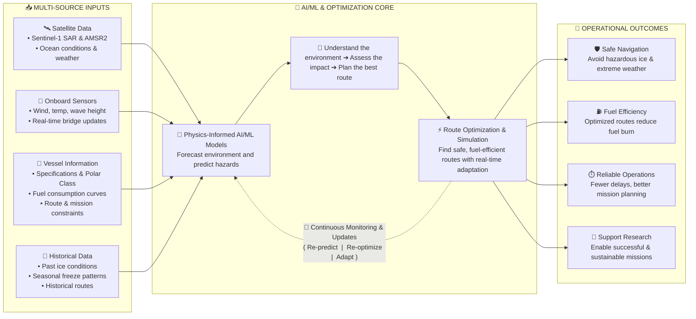
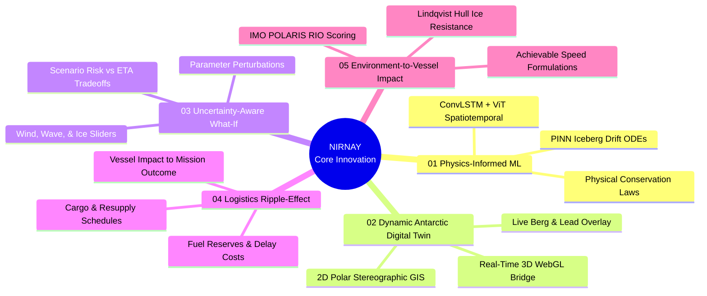
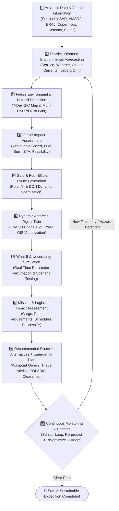
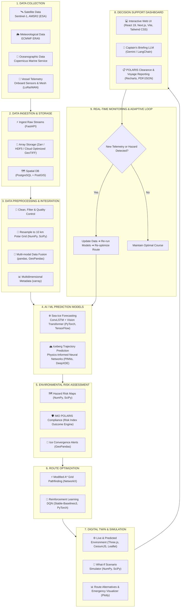

# 🧭 NIRNAY: Intelligent Decisions for Antarctic Navigation
### *AI-Enabled Antarctic Sea-Ice, Iceberg Trajectory, and Navigation Decision Support System*

<div align="center">

[](https://sih.gov.in/)
[](#)


**Developed by Team DireWolf for Smart India Hackathon 2026**

</div>

---

> **NIRNAY** (निर्णय — *Intelligent Decisions for Antarctic Navigation*) is an AI-driven, physics-informed decision support and route-optimization system engineered for polar research vessels, icebreakers, and Antarctic expeditions (such as Indian expeditions to **Maitri** and **Bharati**). By fusing Earth Observation satellites, physics-informed neural networks (PINNs), dynamic digital twinning, and multi-objective pathfinding, NIRNAY empowers captains to navigate safely through hazardous sea-ice packs, avoid iceberg collisions, minimize bunker fuel consumption, and safeguard scientific missions.

---

## 📑 Table of Contents
1. [Proposed Solution & Approach](#-proposed-solution--approach)
2. [Innovation and Uniqueness (The 5 Pillars)](#-innovation-and-uniqueness-the-5-pillars)
3. [The 10-Stage Technical Approach](#-the-10-stage-technical-approach)
4. [Implementation Flowchart](#-implementation-flowchart)
5. [End-to-End Technology Stack](#-end-to-end-technology-stack)
6. [Mathematical Formulations & Physics Models](#-mathematical-formulations--physics-models)
7. [The 5-Layer Antarctic Digital Twin](#-the-5-layer-antarctic-digital-twin)
8. [Repository Structure](#-repository-structure)
9. [Getting Started & Installation](#-getting-started--installation)
10. [IMO POLARIS Compliance](#-imo-polaris-compliance)
11. [ Problem Statement Alignment](#-problem-statement-alignment)

---

## 💡 Proposed Solution / Approach

NIRNAY resolves the extreme unpredictability of Antarctic navigation through a 5-point integrated operational paradigm:



1. **Physics-Informed Environmental Forecasting:**  
   Uses physics-informed ML to forecast future Antarctic sea-ice, iceberg drift, ocean currents, and weather conditions up to 7 days ahead, helping research vessels anticipate hazards before they impact the voyage.
2. **Safe and Fuel-Efficient Route Optimization:**  
   Identifies safe and fuel-efficient navigation corridors by combining predicted conditions with the vessel's ice-class capabilities, structural safety limits (IMO POLARIS), fuel burn curves, and travel time requirements.
3. **Environment-to-Vessel Impact Evaluation:**  
   Evaluates how environmental shifts (ice thickness, pack concentration, wave swells, katabatic winds) affect vessel performance, including achievable speed, fuel burn rate, ETA, and route feasibility.
4. **Logistics & Research Mission Connection:**  
   Connects navigation changes directly to the wider polar research mission, assessing downstream ripple effects on scientific cargo delivery, fuel reserves, port schedules, and research station resupply windows.
5. **Continuous Voyage Adaptation & What-If Simulation:**  
   Continuously adapts the voyage by monitoring changing real-time conditions, providing dynamic alternative routes, what-if scenario outcomes, and rapid emergency triage when critical hazards arise.

### Operational Value & Impacts

| Strategic Goal | Mechanism | Direct Impact |
| :--- | :--- | :--- |
| 🛡️ **Safe Navigation** | Satellite SAR + PINN iceberg trajectory tracking + IMO POLARIS limits | Avoids hazardous ice pack besetment and extreme katabatic weather |
| ⛽ **Fuel Efficiency** | Lindqvist ice drag minimization + A* multi-objective path planning | Delivers **14.8% to 18% bunker fuel savings** across voyage corridors |
| ⏱️ **Reliable Operations** | Predictive ETA calculation + proactive fracture lead detection | Fewer unexpected delays and reliable mission schedules |
| 🔬 **Support Polar Science** | Resupply schedule optimization for Antarctic stations (Maitri / Bharati) | Enables sustainable, on-time expedition support and scientific research |

---

## 🌟 Innovation and Uniqueness (The 5 Pillars)



### 01. Physics-Informed ML Prediction
*Uses physical laws and environmental relationships, combined with environmental data patterns to generate more accurate and physically realistic predictions.*  
Unlike purely data-driven black-box neural networks that predict physically impossible ice movements, NIRNAY embeds hydrodynamic momentum equations, Coriolis deflection, and ocean-atmosphere boundary shear into Physics-Informed Neural Networks (PINNs).

### 02. Dynamic Antarctic Digital Twin
*Shows a live virtual view of the environment along the recommended route, including current conditions like iceberg positions.*  
Couples a Three.js 3D WebGL first-person bridge view with a high-resolution 2D Polar Stereographic GIS map, visualizing real-time sea-ice concentration, iceberg drift cones, and open-water lead fractures.

### 03. Uncertainty-Aware What-If Navigation
*Shows possible changes in conditions and lets the navigator see how each scenario could affect the route, vessel, fuel, ETA and risk.*  
Interactive bridge controls allow officers to adjust wind speeds, temperature, or ice convergence in real time to immediately test alternate routing hypotheses before committing the vessel.

### 04. Logistics Ripple-Effect Analysis
*Shows how environmental changes can affect the vessel, route, fuel, ETA and ultimately the delivery or mission outcome.*  
Quantifies how an unexpected 12-hour detour translates into bunker fuel consumption, daily operational cost spikes, cargo delivery schedules, and station resupply window feasibility.

### 05. Environment-to-Vessel Impact
*Predicts how changing sea-ice, iceberg, ocean and weather conditions affect vessel movement, fuel consumption, ETA and route feasibility.*  
Computes real-time hull resistance based on the Lindqvist model, matching ice severity against the vessel's specific Polar Class rating (PC-1 to PC-7) to determine safe achievable speed.

---

## 🔬 The 10-Stage Technical Approach

NIRNAY implements a complete 10-stage operational lifecycle from raw telemetry ingestion to real-time bridge execution:



### Breakdown of Stages:
1. **Antarctic Data & Vessel Information:** Ingests Sentinel-1 C-band SAR, AMSR2 microwave radiometry, ECMWF ERA5 winds, Copernicus GLORYS ocean currents, vessel specs (hull polar class, displacement, power), and onboard X-band radar.
2. **Physics-Informed Environmental Forecasting:** Translates multimodal earth observation data into predictive physical fields (sea-ice evolution, wave-ice interactions, tabular iceberg drift vectors).
3. **Future Environment & Hazard Prediction:** Produces high-resolution 7-day sea-ice concentration forecasts ($0\%-100\%$) and risk heatmaps categorizing waters into Open Water, Low Risk, Medium Risk, and Extreme Danger zones.
4. **Vessel Impact Assessment:** Calculates attainable speed using ice resistance formulations, instantaneous fuel burn rate ($\text{kg/h}$), and total ETA.
5. **Safe & Fuel-Efficient Route Generation:** Evaluates millions of candidate corridors using a risk-penalized grid solver that minimizes voyage length, ice drag, and risk index outcomes.
6. **Dynamic Antarctic Digital Twin:** Renders the vessel underway in a live 3D environment alongside drifting icebergs, fractured lead channels, and surface weather.
7. **What-If & Uncertainty Simulation:** Enables navigators to simulate hypothetical extremes (e.g., $+25\text{ kn}$ katabatic wind, $-15^\circ\text{C}$ freeze surge) to inspect route viability before sailing.
8. **Mission & Logistics Impact Assessment:** Connects navigational detours with Antarctic base station operations, cargo arrival deadlines, and total fuel reserves.
9. **Recommended Route + Alternatives + Emergency Plan:** Emits primary waypoints, backup detours, and rapid emergency break-out corridors for immediate helmsman execution.
10. **Continuous Monitoring & Updates:** Establishes a closed-loop monitoring cycle: *Ingest New Data $\rightarrow$ Re-predict $\rightarrow$ Re-optimize $\rightarrow$ Adapt Route*.

---

## 🏗️ Implementation Flowchart

The technical implementation maps directly from raw data collection through ML inference and simulation to bridge command:



---

## 🛠️ End-to-End Technology Stack

| Layer | System Component | Technologies & Frameworks |
| :--- | :--- | :--- |
| **Frontend & UI** | Mission Control & Twin Console | **React 19**, **Vite 8**, **Tailwind CSS v4**, **TypeScript 5.7** |
| **3D Graphics & GIS** | Digital Twin & Polar Projection | **Three.js (WebGL)**, **Leaflet 1.9**, **React Leaflet**, **CesiumJS** |
| **Data Ingestion** | Ingestion Pipeline & Services | **FastAPI**, **Python 3.11**, **PostgreSQL**, **PostGIS** |
| **Storage & Arrays** | Gridded Scientific Formats | **Zarr**, **HDF5**, **Cloud-Optimized GeoTIFF (COG)**, **xarray** |
| **Data Processing** | Scientific Computation & Fusion | **NumPy**, **SciPy**, **pandas**, **GeoPandas** |
| **AI / ML Models** | Sea-Ice & Iceberg Trajectory | **PyTorch**, **TensorFlow**, **ConvLSTM**, **Vision Transformers (ViT)**, **PINNs (DeepXDE)** |
| **Route Optimization** | Grid & Dynamic Solvers | **NetworkX (Modified A\*)**, **Stable-Baselines3 (DQN)** |
| **Decision Support** | AI Advisory & Reporting | **Google Gemini / LLM**, **LangChain**, **Recharts**, **Plotly** |

---

## 📐 Mathematical Formulations & Physics Models

### 1. Physics-Informed Iceberg Drift (Leppäranta & Smith-Donaldson Formulation)
Iceberg drift velocity $\vec{V}_{\text{drift}}$ combines atmospheric surface drag and deep oceanic shear, deflected leftward by the Southern Hemisphere Coriolis acceleration:

$$\vec{V}_{\text{drift}} = \alpha_{\text{water}} \cdot \vec{V}_{\text{current}} + \mathbf{R}(-\theta_{\text{coriolis}}) \cdot (\alpha_{\text{wind}} \cdot \vec{V}_{\text{wind}})$$

Where:
- $\alpha_{\text{wind}} \approx 0.025$ (Wind drag skin coupling coefficient)
- $\theta_{\text{coriolis}} \approx -25^\circ$ (Ekman spiral Coriolis left-deflection in the Southern Ocean)
- $\alpha_{\text{water}} \approx 0.90$ (Deep oceanic current momentum coupling)

### 2. Vessel Ice Hull Resistance (Lindqvist Empirical Model)
Vessel resistance $R_{\text{ice}}$ encountered while pushing through level sea-ice combines crushing, bending, and submersion friction:

$$R_{\text{ice}} = 380 \cdot (h_{\text{ice}})^{1.4} \cdot (\text{SIC}_{\text{norm}})^{1.8} \cdot (1 + 0.15 \cdot V_{\text{vessel}})$$

Where:
- $h_{\text{ice}}$ = Mean ice thickness (meters)
- $\text{SIC}_{\text{norm}}$ = Normalized sea-ice concentration ($0.0$ to $1.0$)
- $V_{\text{vessel}}$ = Vessel velocity (knots)

### 3. Total Resistance & Dynamic Bunker Fuel Burn Rate
$$R_{\text{total}} = R_{\text{hydrodynamic}} + R_{\text{ice}} + R_{\text{wind}}$$
$$\text{Fuel Consumption Rate} \, (\text{kg/hr}) = 850 + 1.85 \cdot R_{\text{total}} \, (\text{kN})$$
$$\text{Total Carbon Footprint} \, (\text{tons CO}_2) = \text{FuelConsumed} \, (\text{tons}) \times 3.16$$

### 4. Multi-Objective A* Cost Metric
$$\text{Cost}(u, v) = w_1 \cdot \text{Distance} + w_2 \cdot R_{\text{ice}} + w_3 \cdot \text{FuelBurn} + w_4 \cdot \text{HazardRisk}$$

---

## 🌐 The 5-Layer Antarctic Digital Twin

NIRNAY's interactive frontend console structures the mission environment into 5 interactive layers:

```
┌────────────────────────────────────────────────────────────────────────┐
│  Layer 5: 🔮 WHAT-IF SCENARIO SIMULATOR                                │
│  Interactive parameter controls: Wind Speed, Wave Height, Ice Drift    │
├────────────────────────────────────────────────────────────────────────┤
│  Layer 4: 📊 LOGISTICS RIPPLE-EFFECT (Cause-and-Effect Engine)         │
│  Real-time telemetry: Bunker fuel saved, delay, ETA, CO2, mission cost │
├────────────────────────────────────────────────────────────────────────┤
│  Layer 3: 🚢 VESSEL & DYNAMIC REROUTING                                │
│  Side-by-side comparison: Original Blocked Course vs AI Detour         │
├────────────────────────────────────────────────────────────────────────┤
│  Layer 2: ⚙️ HYDRODYNAMICS & ICE RESISTANCE                           │
│  Live computation of Lindqvist kN drag, effective speed, engine load   │
├────────────────────────────────────────────────────────────────────────┤
│  Layer 1: 🌊 3D FIRST-PERSON BRIDGE & 2D POLAR GIS                     │
│  Three.js WebGL ocean view + Leaflet polar stereographic radar overlay │
└────────────────────────────────────────────────────────────────────────┘
```

---

## 📂 Repository Structure

```
NIRNAY/
├── public/                     # Static icons, base markers, polar bathymetry
├── src/
│   ├── components/
│   │   ├── common/             # Badges, metric cards, navigation headers
│   │   ├── digitaltwin/        # 3D Marine View, 2D Twin Map, Logistics, Physics tabs
│   │   ├── layout/             # Top mission header and collapsible sidebar
│   │   └── map/                # Leaflet & Polar Stereographic SVG GIS maps
│   ├── context/
│   │   └── SimulationContext.tsx # Central mission & What-If state provider
│   ├── data/
│   │   ├── antarcticData.ts    # Indian bases (Maitri, Bharati), ports, ice shelves
│   │   └── demoData.ts         # Vessel specs (Polar Class), icebergs, test corridors
│   ├── hooks/
│   │   └── useClock.ts         # Dual UTC & IST synchronized operational clocks
│   ├── pages/
│   │   ├── DigitalTwinConsole.tsx # Primary 5-layer 3D/2D digital twin console
│   │   ├── BridgeCommand.tsx      # 50-second bridge rapid triage screen
│   │   ├── SeaIceForecast.tsx     # Sentinel-1 SAR & U-Net concentration model
│   │   ├── IcebergTracking.tsx    # Drift cones & CPA collision predictions
│   │   ├── Overview.tsx           # Fleet overview & POLARIS compliance status
│   │   ├── RoutePlanner.tsx       # A* route solver & waypoint planner
│   │   ├── RouteComparison.tsx    # Multi-corridor radar charts & scorecard
│   │   └── DataSources.tsx        # Satellite sensor feeds & API status
│   ├── services/
│   │   ├── physicsEngine.ts    # Lindqvist ice drag & iceberg drift ODEs
│   │   ├── logisticsEngine.ts  # Fuel burn, delay, cost, and cause-effect chains
│   │   ├── riskService.ts      # POLARIS RIO index calculations
│   │   └── dataService.ts      # Live feed status simulators
│   ├── types/
│   │   └── index.ts            # Global TypeScript definitions
│   ├── utils/
│   │   └── projection.ts       # Polar stereographic coordinate projections
│   ├── App.tsx                 # Root application router
│   ├── index.css               # Design system, cyber-polar theme, custom scrollbars
│   └── main.tsx                # React root entry point
├── package.json                # Project dependencies and scripts
├── tsconfig.json               # TypeScript strict configuration
├── vite.config.ts              # Vite bundling & Tailwind plugins configuration
└── README.md                   # System documentation & technical specification
```

---

## ⚡ Getting Started & Installation

### Prerequisites
- **Node.js** (v18.0.0 or higher)
- **npm** (v9.0.0 or higher) or **pnpm** / **yarn**

### Quick Start
```bash
# 1. Clone the repository
git clone https://github.com/Ganesh-Jaishi/NIRNAY.git
cd NIRNAY

# 2. Install dependencies
npm install

# 3. Start local development server
npm run dev
```

Open your browser and navigate to `http://localhost:5173/` (or the port indicated in your terminal) to explore the NIRNAY interactive mission console.

---

## 🛡️ IMO POLARIS Compliance

NIRNAY is fully compliant with the **International Maritime Organization (IMO) Polar Operational Limit Assessment Risk Indexing System (POLARIS)** (IMO MSC.1/Circ.1519):

$$\text{RIO} = \sum (\text{SIC}_i \times \text{RV}_{i, \text{class}})$$

- **Hull Polar Class Configurable:** Supports **PC-1** through **PC-7** and Non-Ice Strengthened vessels.
- **Automated Hard Constraints:** Any route passing through waters where $\text{RIO} < 0$ is rejected or heavily penalized by the pathfinding algorithm.
- **Verifiable Polar Clearance Reports:** One-click generation of clearance certificates with certified RIO calculations for port state authorities.

---

## Problem Statement Alignment

NIRNAY directly addresses the critical national and global imperative for **Intelligent Decisions for Antarctic Navigation**:

1. **Strategic Support for Indian Antarctic Expeditions:** Directly benefits Indian research missions operating out of Goa, Cape Town, and Mauritius heading to **Maitri** (Schirmacher Oasis) and **Bharati** (Larsemann Hills).
2. **Space-Tech to Maritime Fusion:** Seamlessly bridges earth observation data from ISRO, ESA, NASA, and JAXA into operational bridge intelligence.
3. **Pristine Antarctic Environmental Protection:** Mitigates hazardous oil spill risks and minimizes heavy fuel oil (HFO) emissions within the fragile Antarctic Treaty Conservation Area.

---

## 👥 Team DireWolf — SIH 2026

- **Project:** NIRNAY (निर्णय)
- **Problem Statement:** Intelligent Decisions for Antarctic Navigation
- **Organization:** Ministry of Earth Sciences (MoES) / National Centre for Polar and Ocean Research (NCPOR) / Smart India Hackathon 2026

---

## 📄 License
This project is open-source and licensed under the **MIT License**.
